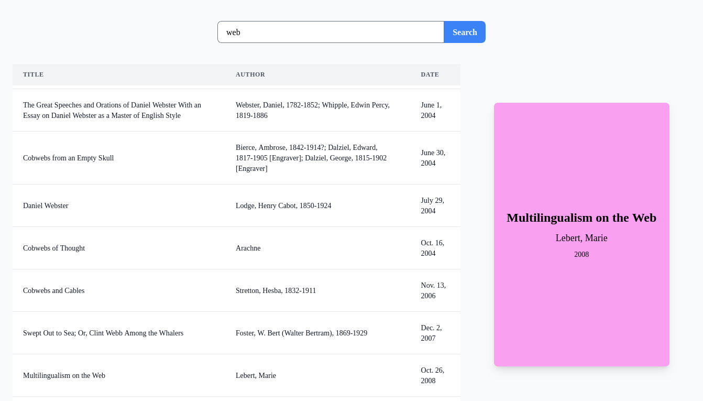

## Overview

This project is a demonstration of integrating Django with HTMX to achieve partial page reloads for a dynamic and
responsive user experience. The primary goal is to explore the capabilities of HTMX in enhancing Django applications,
focusing on reducing full page reloads and increasing interactivity with minimal use of JavaScript.

## Project description

The application is a Django-based project utilizing a SQLite database, populated with a collection of books available
from the Project Gutenberg. The interface provides users with two main interactive features:

1. **Book Search**: Users can search for books by their titles. The search functionality is designed to be
   case-insensitive and can match partial titles, allowing for flexible user queries.

2. **Book Cover Display**: Upon clicking on a search result, users can view a representation of the book's
   cover. The cover is a simplified placeholder generated using the book's information.

No JavaScript was written for the behavior. The only two dependencies are therefore HTMX and Tailwind for a more
pleasant style.

## How to run

- `docker-compose up`
- Go to http://localhost:8000